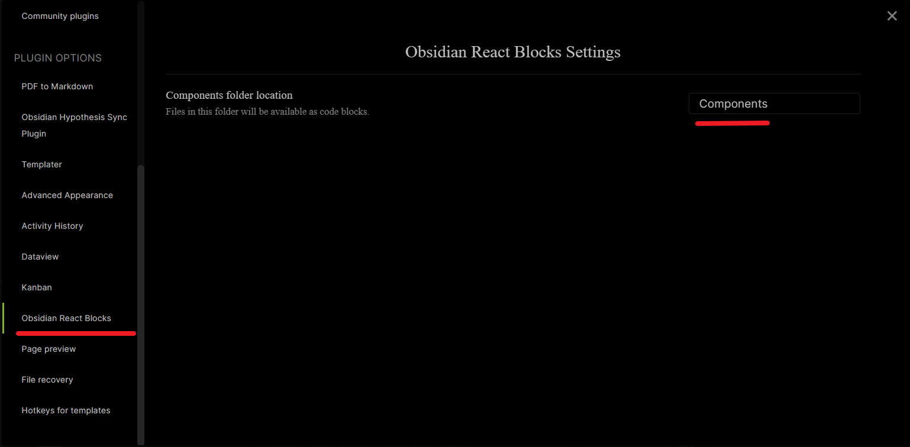

[](https://github.com/elias-sundqvist/obsidian-react-components/releases/latest)

# Obsidian React Components

This is a plugin for Obsidian (https://obsidian.md).

It allows you to write and use React components with Jsx inside your Obsidian notes. 

## Demonstration


## Getting Started 

In order to use the plugin, you must first specify a folder for the Jsx functions / react components. 



Every note in this directory will be interpreted as the content of a Jsx function (implicitly of the form `props=>{your code here}`)

Every file becomes a function/react component with the same name as the note. 

## Using Components

Jsx code can be called both using full code blocks (using the `jsx-` environment) or though inline code (with the prefix `jsx-`).


As can be seen above, you can either include components using the block level (code environment) approach:  

````
```jsx-
<Testcomponent source="Click Me!"/>
```
````

... or using the inline code (with prefix) approach

```md
A dice roller:  `jsx-<DiceRoller sides={10}/>`
```

The definitions for the example components used above can be found in the [Example Components](#Example-components) section further down. 

## Writing Components

The syntax for writing components is regular [Jsx Syntax](https://reactjs.org/docs/introducing-jsx.html)

Each file is interpreted as a single function with the same name as the note file.  So if you, in obsidian, write the note `Clock` inside your components folder, then all other Jsx code blocks will get access to a corresponding new function/component `Clock`. 

The content of your component file is implicitly wrapped in `props=>{...}`. This means that you *don't* write the function signature yourself. You *do*, however, need to include the `return` keyword in your code. 

Other things to keep in mind:
* Since the notes are interpreted as function variables, they must follow the javascript variable naming rules.
    * Variable names cannot contain spaces.
    * Variable names must begin with a letter, an underscore (_) or a dollar sign ($).
    * Variable names can only contain letters, numbers, underscores, or dollar signs.
    * Variable names are case-sensitive.
    * Certain words may not be used as variable names, because they have other meanings within JavaScript. Check out this [complete list of the reserved words](https://www.dummies.com/cheatsheet/javascriptforkids).
* In order to be used as a React component, the first letter of the function must be capitalized. 

## Component Scope

The react components have access to everything inside the global scope. (Use with caution, API changes could break your components).

Besides this, the components have access to `React`, `ReactDOM`, `useState`, and `useEffect`. 
This allows you to easily write functional components. 

Besides that, `ctx`, which is the *file context* is also available. You can, for instance, get frontmatter data from here. Note, however, that the components don`t automatically refresh after the frontmatter is updated. 

In the future, I would like to add an object that exposes useful variables and is more resilient to API changes. (similar to `tp` in the [Templater Plugin](https://github.com/SilentVoid13/Templater)).

## Contributing

Feel free to contribute.

You can create an [issue](https://github.com/elias-sundqvist/obsidian-react-components/issues) to report a bug, suggest an improvement for this plugin, ask a question, etc.

You can make a [pull request](https://github.com/elias-sundqvist/obsidian-react-components/pulls) to contribute to this plugin development.


## Changelog

### 0.0.8 (2021-08-25) *Minor rendering fix*

* Issue with loading components on obisian start has been resolved. (Issue #19)

### 0.0.7 (2021-07-20) *Add support for mobile, Typescript*

* Issue with loading plugin on Obsidan Mobile has been resolved.
* Typescript syntax is now supported
* Unused dependencies removed

### 0.0.6 (2021-06-19) *Add support for skypack imports, bugfixes*

* Added support for url based imports, such as `import styled from 'https://cdn.skypack.com/styled-components/'`
  * *Example:* 
* Improved stability of component loading

### 0.0.5 (2021-05-22) *Enable dynamic updates of Markdown Rendering component, minor changes*

* Updating the `src` prop of the `Markdown` component previously did not cause the component to rerender. This is now fixed.
* For developers: you can now create a `.vault_plugin_dir` file containing the path to the plugin in your vault: (e.g. `path\to\my\vault\.obsidian\plugins\obsidian-react-components`). Then `yarn build` will automatically copy the compiled files to the correct place. So you only have to reload the plugin in Obsidian to see changes take effect.

### 0.0.4 (2021-05-20) *Improved Component Loading and Error Handling + useIsPreview*

* Add a new setting to disable component refreshing 
  * Useful if re-rendering of components is costly, such as if the component makes API calls.
* Make component loading more reliable (Resolves issue #13)
* Significantly improve error handling
  * All errors are rendered as react components. You can click a button in the component to show the error in the console. 
* Add a command to manually refresh components
  * `Obsidian React Components: Refresh React Components`
* Replace `isPreviewMode` with `useIsPreview`, which check the current pane of the component instead of the currently active component (Resolves issue #12)
  
  Example:
 
    ```js
    const isPreview = useIsPreview()
    if(isPreview) {
      // this only happens if the pane which the component is attached to is in preview mode.
    }
    ```


### 0.0.3 (2021-05-10) *Markdown rendering component, more hooks, and minor fixes*

* Made some minor fixes based on feedback in the [community-plugins PR](https://github.com/obsidianmd/obsidian-releases/pull/280)
* Added a `Markdown` component, which can be used to render makdown.
  * Usage: ``` `jsx-<Markdown src={"* This is a bullet"}/>` ```
* Added `obsidian` to the component scope
* Added more hooks: `useCallback`, `useContext`, `useMemo`, `useReducer`, `useRef`

### 0.0.2 (2021-05-10) *New functionality, bug fixes, and refactoring*
* @lucasew Added an `isPreviewMode` function to the component scope. (PR #5)
  > There is a rule that in React you must call the same hooks at every render so early returns are not good.
  > 
  > The user can easily check if the note is on preview mode inside its component and can return null if it's the case.

* Components which contain sub-components are now correctly updated when the sub-component code is modified. (PR #11)

* Users are now warned when creating components with invalid names (PR #10)

### 0.0.1 (2021-05-04) *First Release*
* Basic functionality of the plugin implemented


## Example components

```jsx
// file: Counter.md
const [count, setCount] = useState(0)
return (
<div>
  <p>You clicked me {count} times!!!</p>
  <button onClick={() => setCount(count + 1)}>
	{props.source}
  </button>
</div>
)
```

```jsx
// file: Clock.md
 const [date, setDate] = useState(new Date());
 useEffect(() => {
  var timerID = setInterval( () => setDate(new Date()), 1000 );
  return function cleanup() {
      clearInterval(timerID);
    };
 });
return (
  <div>
	<h1>Hello, world!</h1>
	<h2>It is {date.toLocaleTimeString()}.</h2>
  </div>
); 
```


```jsx
// file: rand.md
return Math.random()
```

```jsx
// file: DiceRoller.md
let diceRoll = ()=>Math.ceil(rand()*props.sides)
let [num, setNum] = useState(diceRoll())
return (<span>
	<button onClick={()=>setNum(diceRoll())}> Roll the {props.sides}-sided Die</button>
	<span>The number is {num}</span>
</span>)
```

```jsx
// file: Testcomponent.md
return (
<div style={{color: "blue"}}>
	<Clock/>
	<Counter source={props.source}/>
</div>
)
```


## License

[Obsidian React Components](https://github.com/elias-sundqvist/obsidian-react-components) is licensed under the GNU AGPLv3 license. Refer to [LICENSE](https://github.com/elias-sundqvist/obsidian-react-components/blob/master/LICENSE.TXT) for more information.